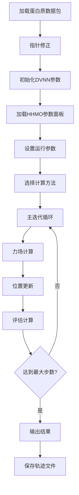

# QOMD完整项目文档

# 项目概述

### 项目名称

QOMD (Quantitative Oscillator Molecular Dynamics) - 河海大学自主研发的蛋白质分子动力学模拟系统

### 项目背景

QOMD是由河海大学计算机学院孟朝晖老师课题组开发的独立自主分子动力学蛋白质模拟软件系统，具有以下特点：

1.  **完全独立自主**：计算原理、数据结构、体系结构、代码实现均为独立自主，与其他分子动力学系统无传承关系
2.  **模拟参数可调**：基于新设计的分子轨道和原子轨道建模，原子相互作用的电荷力和弹性振子震动频谱均进行参数化，可动态调整
3.  **神经网络集成**：结合DVNN（动态变量神经网络）进行参数优化和结果分析

### 核心目标

通过分子动力学计算模拟蛋白质原子运动，生成动态点云数据，为深度学习研究提供可控的、参数可调的数据源。

------

## 项目架构

### 整体架构图

```
┌──────────────────────────────────────────────────────────────────────────┐
│                           QOMD 2024 系统架构                              │
├──────────────────────────────────────────────────────────────────────────┤
│                                                                          │
│  ┌─────────────────┐    ┌─────────────────┐    ┌─────────────────┐       │
│  │   输入数据      │    │   配置参数      │    │   字典数据      │       │
│  │ proteinBag.byte │    │ QOMD_run_para   │    │ hhmoPanel.byte  │       │
│  │ (蛋白质数据包)   │    │ cppCuda_run_para│    │ (力场参数)      │       │
│  └─────────┬───────┘    └─────────┬───────┘    └─────────┬───────┘       │
│            │                      │                      │               │
│            └──────────────────────┼──────────────────────┘               │
│                                   ▼                                      │
│  ┌─────────────────────────────────────────────────────────────────────┐ │
│  │                    QOMD 模拟核心引擎                                 │ │
│  │  ┌─────────────┐  ┌─────────────┐  ┌─────────────┐  ┌─────────────┐ │ │
│  │  │ 指针修正    │  │ 力场初始化  │  │ 迭代计算    │  │ 轨迹记录    │ │ │
│  │  │ Pointer     │  │ Force Field │  │ Iterator    │  │ Trajectory  │ │ │
│  │  │ Revision    │  │ Setup       │  │ Engine      │  │ Recording   │ │ │
│  │  └─────────────┘  └─────────────┘  └─────────────┘  └─────────────┘ │ │
│  └─────────────────────────────────────────────────────────────────────┘ │
│                                   │                                      │
│                                   ▼                                      │
│  ┌─────────────────────────────────────────────────────────────────────┐ │
│  │                      DVNN 数据处理模块                              │ │
│  │  ┌─────────────┐  ┌─────────────┐  ┌─────────────┐  ┌─────────────┐ │ │
│  │  │ 原子坐标    │  │ 键/角/面    │  │ 时间序列    │  │ 评估分析    │ │ │
│  │  │ VertexList  │  │ Force Lists │  │ TimePoint   │  │ Evaluation  │ │ │
│  │  └─────────────┘  └─────────────┘  └─────────────┘  └─────────────┘ │ │
│  └─────────────────────────────────────────────────────────────────────┘ │
│                                   │                                      │
│                                   ▼                                      │
│  ┌─────────────────────────────────────────────────────────────────────┐ │
│  │                        输出数据                                      │ │
│  │  ┌─────────────┐  ┌─────────────┐  ┌─────────────┐  ┌─────────────┐ │ │
│  │  │ 轨迹文件    │  │ 记录文件    │  │ PDB文件     │  │ 分析报告    │ │ │
│  │  │time_point   │  │record_*.txt │  │structure.pdb│  │test_output  │ │ │
│  │  │.byte        │  │             │  │             │  │.txt         │ │ │
│  │  └─────────────┘  └─────────────┘  └─────────────┘  └─────────────┘ │ │
│  └─────────────────────────────────────────────────────────────────────┘ │
└──────────────────────────────────────────────────────────────────────────┘
```

### 模块层次结构

### 1. 核心层 (Core Layer)

-   **qomdProtein2024.cpp**: 主程序入口，控制整个模拟流程
-   **libQomd.a**: 核心计算库，包含所有分子动力学计算功能

### 2. 数据结构层 (Data Structure Layer)

-   **aBase.h**: 基础数据结构定义
-   **aDvnn.h**: DVNN相关数据结构
-   **aDir.h**: 路径和系统配置

### 3. 功能模块层 (Function Module Layer)

-   **dvnnFunc.cpp**: DVNN功能实现
-   **各种record_\*.txt**: 详细的运行记录文件

------

## 关键数据结构

### 1. 蛋白质数据包 (ProteinPackage)

存储完整的蛋白质信息，包括：

-   原子坐标列表
-   键连接信息
-   力场参数
-   运行时参数

### 2. DVNN数据结构

### DvnnAtomicVertex (原子顶点)

```cpp
struct DvnnAtomicVertex {
    int residueID;          // 残基ID
    int vertexNameSN;       // 原子序列号
    int vertexNameID;       // 原子名称ID
    DvnnString vertexName;  // 原子全名
    double qomdCharge;      // QOMD固定电荷
    double hhmoCharge;      // HHMO可调电荷
    DvnnPoint Position;     // 三维坐标
};
```

### DvnnTimePoint (时间点)

```cpp
struct DvnnTimePoint {
    int vertexIdx;      // 原子索引
    int vertexNameSN;   // 原子序列号
    int valid;          // 有效性标志
    int t;              // 时间步
    double x, y, z;     // 三维坐标
};
```

### 力场数据结构

-   **DvnnForceBond**: 化学键信息
-   **DvnnForceAngle**: 键角信息
-   **DvnnForceDihedral**: 二面角信息
-   **DvnnForcePlane**: 平面约束信息

### 3. 配置参数结构

### InputPara (运行参数)

控制模拟行为的所有参数，包括：

-   运行模式 (串行/并行)
-   计算方法 (COUVDW/ELCCOL)
-   力场参数选择 (QOMD/HHMO)
-   模拟步数和输出频率
-   各种物理约束参数

------

## 核心算法和计算流程

### 1. 主要计算流程 (procedure_24102)



### 2. 力场计算方法

### ELCCOL方法 (推荐)

-   **碰撞力 (COL)**: 处理原子间的短程排斥
-   **电荷力 (ELC)**: 处理长程静电相互作用
-   参数可调，支持多种物理模型

### COUVDW方法 (传统)

-   **库仑力**: 静电相互作用
-   **范德华力**: 短程相互作用
-   使用固定参数

### 3. 迭代计算核心

每个飞秒级时间步的计算包括：

1.  **内层迭代**: 处理键合约束 (键长、键角、平面、二面角)
2.  **外层迭代**: 处理非键相互作用 (碰撞、静电)
3.  **温度评估**: 计算系统温度和能量
4.  **轨迹记录**: 保存原子坐标

------

## 输入文件详解

### 1. 蛋白质数据包文件

-   **proteinBag_1VII_linux.byte**: 1VII蛋白质的完整数据包
-   **proteinBag_1VII_rod_linux.byte**: 1VII的展开状态 (用于折叠模拟)
-   包含原子坐标、力场参数、拓扑信息

### 2. HHMO参数面板

-   **hhmoPanel_linux.byte**: 可调力场参数
-   包含电荷参数、频率参数等

### 3. 配置文件

详见后续章节的专门说明

------

## 输出文件详解

### 1. 轨迹文件

-   **time_point_linux.byte**: 二进制轨迹文件，包含所有时间步的原子坐标

### 2. 记录文件

-   **record_vertex.txt**: 原子运动记录
-   **record_bond.txt**: 键长变化记录
-   **record_angle.txt**: 键角变化记录
-   **record_dihedral.txt**: 二面角变化记录
-   **record_plane.txt**: 平面约束记录
-   **record_harmonic.txt**: 谐振子记录
-   **record_elccol.txt**: 电荷碰撞力记录
-   **record_couvdw.txt**: 库仑范德华力记录

### 3. 分析文件

-   **test_output_2024.txt**: 主要运行统计
-   **pointer_revise.txt**: 指针修正日志
-   **dvnn_all_list_init.txt**: 初始状态数据
-   **dvnn_all_list_end.txt**: 最终状态数据

------

## 编译和部署

### 系统要求

-   **操作系统**: Linux (推荐) 或 Windows
-   **编译器**: GCC 或 MSVC
-   **依赖库**: 标准C++库、数学库

### 编译方法

```bash
cd ProteinCpp2025_0109/obj
make
```

### 运行方法

```bash
./qomdProtein2024
```

------

## 扩展性和定制化

### 1. 参数调整

通过修改配置文件可以调整：

-   模拟时间和步长
-   力场强度
-   温度控制参数
-   输出频率

### 2. 新蛋白质支持

添加新的蛋白质数据包文件即可支持新的蛋白质模拟

### 3. 算法扩展

模块化设计便于添加新的计算方法和分析功能

------

## 应用场景

### 1. 蛋白质折叠研究

通过从展开状态开始模拟，研究蛋白质的折叠过程

### 2. 结构稳定性分析

分析蛋白质在不同条件下的结构稳定性

### 3. 机器学习数据生成

为深度学习算法提供大量可控的蛋白质动态数据

### 4. 方法学研究

开发和测试新的分子动力学算法和力场模型

------

## 技术特色

### 1. 独立自主

完全自主的理论体系和实现，不依赖现有的分子动力学软件包

### 2. 参数可调

所有关键物理参数均可调整，便于算法研究和优化

### 3. 神经网络集成

内置DVNN模块，便于与机器学习算法结合

### 4. 跨平台支持

支持Linux和Windows平台，便于在不同环境下部署

------

## 未来发展方向

### 1. GPU加速

完善CUDA并行计算功能，提升计算效率

### 2. 多蛋白质系统

支持蛋白质-蛋白质相互作用模拟

### 3. 溶剂化模型

加入显式或隐式溶剂模型

### 4. 机器学习集成

深度集成神经网络，实现智能参数优化

------

本文档提供了QOMD项目的完整技术概览，详细的操作指南请参考后续的专门文档。